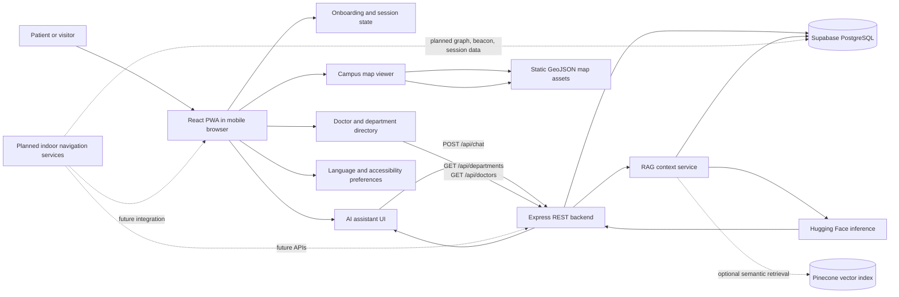
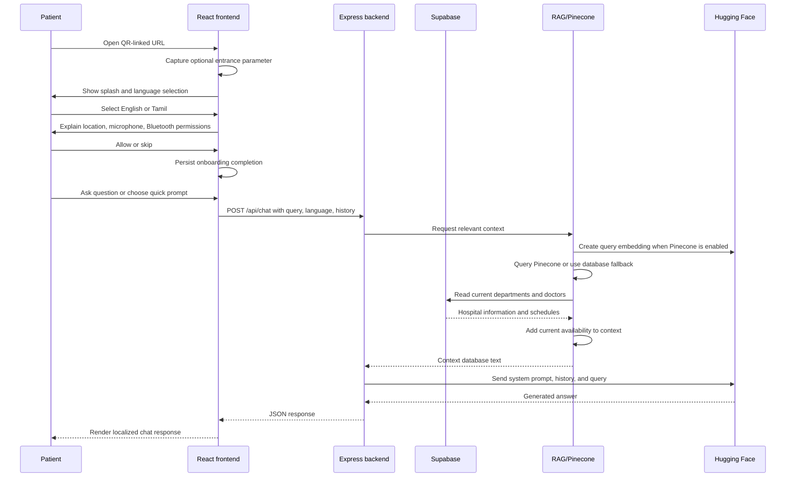
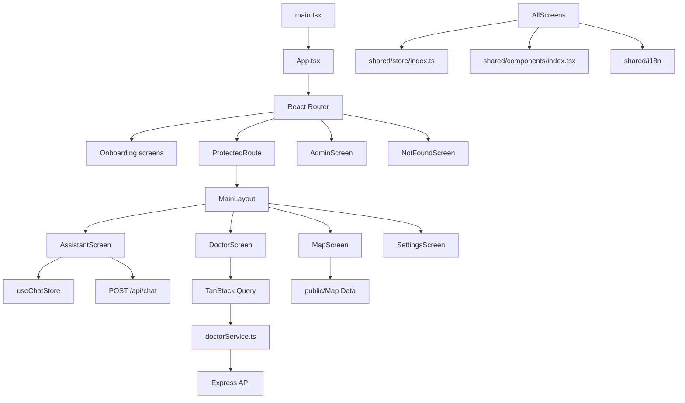
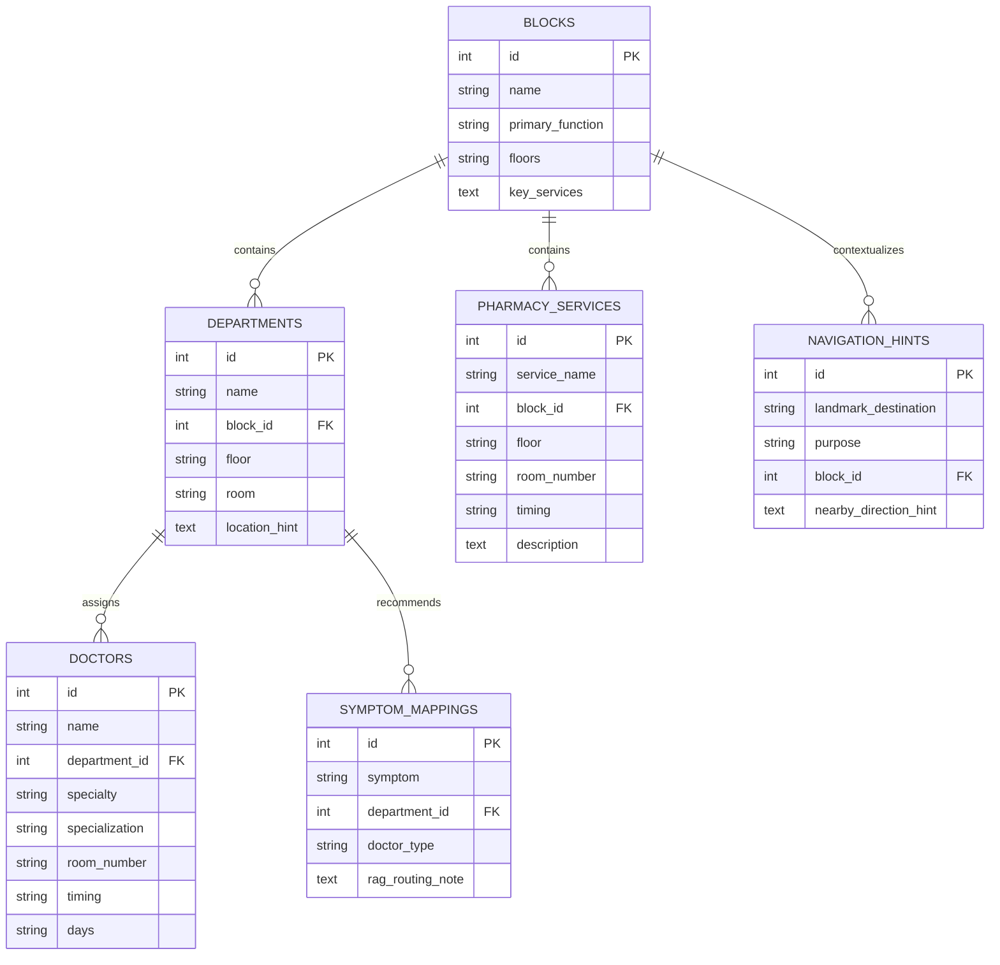
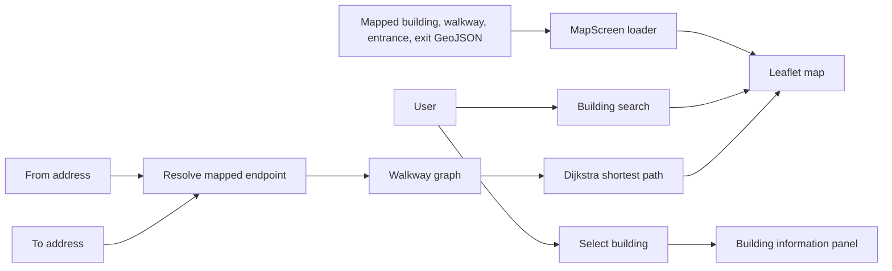
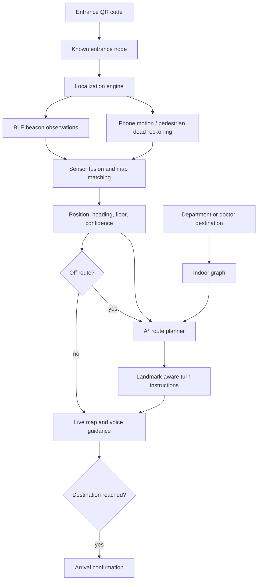
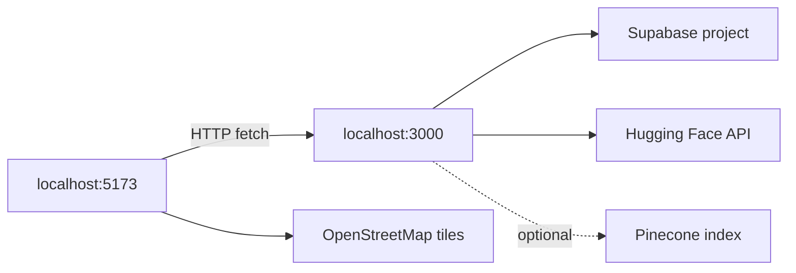

# HospiGuide AI — System Architecture and Module Workflows

**Document purpose:** This is the current-state architecture reference for HospiGuide AI. It is written for project understanding, Claude context, architecture diagrams, technical presentations, and PPT content generation.

**Architecture status:** Research prototype / partially integrated implementation

**Last reviewed:** 2026-09-11

## 1. Executive Summary

HospiGuide AI is intended to be a bilingual, smartphone-first hospital guidance system. A visitor enters through a QR-linked web application, selects a language, optionally grants device permissions, asks the assistant for help, discovers departments and doctors, and views a map of the hospital or prototype campus.

The repository currently contains two connected but not yet fully integrated capabilities:

1. **Hospital information and AI assistant:** Implemented through React, Express, Supabase/PostgreSQL, Hugging Face, and optional Pinecone retrieval. It supports department/doctor lookup, current doctor availability, Tamil/English chat, and browser speech-to-text.
2. **Campus map visualization:** Implemented through React Leaflet and static GeoJSON assets. It displays buildings, walkways, entrances, exits, search, selection, fullscreen, and recentering.

The complete indoor-navigation system described in the project specification is the target architecture, not the current runtime. Graph routing, BLE scanning, pedestrian dead reckoning, sensor fusion, live position tracking, route recalculation, voice navigation output, and admin CRUD are represented in the design/state stores but are not implemented as active services yet.

## 2. Current System Boundary

### Implemented now

- React/Vite frontend with responsive PWA-style screens.
- Onboarding flow: splash, QR entrance capture, language choice, and permission request/skip.
- Protected patient application flow after onboarding.
- Bilingual UI translations for English and Tamil.
- Chat interface with text input, quick prompts, browser speech recognition, chat history, and backend integration.
- Backend REST API for health, departments, doctors, department-specific doctors, and chat.
- Supabase-backed hospital information model.
- Doctor availability calculation in both the doctor directory and RAG context generation.
- Hugging Face chat generation with a fallback model.
- Optional Pinecone semantic retrieval over department and doctor records.
- Leaflet mapped-building view with static GeoJSON overlays and a client-side shortest-path route builder.
- Local persistent state for language, permissions, navigation preferences, and selected session information.
- Admin UI shell with a local hardcoded password and placeholder data-management tabs.

### Designed but not active

- Indoor node/edge graph and A* routing for BLE/current-position navigation.
- Multi-floor route planning with lift/stair accessibility weighting.
- BLE beacon scanning and beacon-based position correction.
- Pedestrian dead reckoning and sensor fusion.
- Live blue-dot location, heading, confidence, and deviation detection.
- Navigation instructions, route recalculation, and arrival detection.
- Backend map, route, beacon, session, WebSocket, and analytics APIs.
- Structured symptom-to-department recommendation output.
- Gemini integration described in the specification; the current implementation uses Hugging Face instead.
- Text-to-speech navigation announcements.
- Offline service-worker caching.
- Secure admin authentication and CRUD operations.

## 3. High-Level Architecture



### Runtime responsibility split

| Layer | Responsibility today | Intended future responsibility |
|---|---|---|
| Browser / React frontend | Screens, navigation between screens, local state, chat input, doctor directory, map rendering, browser permissions | Sensor access, BLE scanning, localization, route visualization, turn-by-turn guidance, voice output |
| Express backend | REST routing, Supabase reads, chat orchestration, RAG context assembly | Route computation/validation, map graph APIs, beacon/session APIs, analytics, secure AI proxy, admin APIs |
| Supabase PostgreSQL | Hospital blocks, departments, doctors, pharmacy services, symptom mappings, navigation hints | Also graph nodes, graph edges, beacons, sessions, route metadata, and administrative data |
| Hugging Face | Chat completion and embeddings | AI assistant generation and multilingual semantic processing unless replaced by the specified Gemini design |
| Pinecone | Optional semantic retrieval over department and doctor vectors | Expanded retrieval over symptoms, services, landmarks, and navigation knowledge |
| Static map assets | Mapped buildings, walkways, entrance, exit | Indoor floor plans and navigation graph visualization source |

## 4. End-to-End User Workflow



## 5. Frontend Architecture

### Frontend technology stack

| Area | Technology | Architectural role |
|---|---|---|
| UI runtime | React 19 | Component-based screen composition |
| Language | TypeScript 6 | Typed frontend contracts and state |
| Build/dev server | Vite | Local development and production bundling |
| Navigation | React Router 7 | URL-based screen and flow routing |
| Client state | Zustand | Session, language, permission, UI, navigation, map, and chat state |
| Server state | TanStack React Query | Cached department and doctor API data |
| Map renderer | Leaflet + React Leaflet | Interactive campus map, GeoJSON layers, markers, popups, and controls |
| Styling | Tailwind CSS 4 and custom CSS theme | Responsive layout, design tokens, animations, and Leaflet overrides |
| Icons | Lucide React | UI icons |
| Speech input | Browser SpeechRecognition / Web Speech API | Voice-to-text input in English or Tamil |
| PWA metadata | Web App Manifest | Installable-app metadata; offline worker is not present yet |

### Frontend module map



### Module 5.1: Application bootstrap and routing

**Primary files:** `frontend/src/main.tsx`, `frontend/src/app/App.tsx`

**Purpose:** Create the React root, load global CSS, configure the query client, install the error boundary, and define all URL-level application flows.

**Workflow:**

1. `main.tsx` mounts the React application in `StrictMode`.
2. `App.tsx` creates the TanStack Query client.
3. The error boundary wraps the entire router and shows a retry view if a render error reaches the application boundary.
4. Public onboarding routes are available at `/`, `/language`, and `/permissions`.
5. `/app/*` is guarded by `onboardingComplete` from the session store.
6. The protected layout provides chat, map, doctors, and settings tabs.
7. `/admin` is a separate staff-oriented UI route.
8. Unknown paths render the 404 screen.

**Current status:** Implemented. `ArrivalScreen` exists as a component but is not registered in the router.

### Module 5.2: Onboarding and anonymous session

**Primary files:** `SplashScreen.tsx`, `LanguageScreen.tsx`, `PermissionsScreen.tsx`, `shared/store/index.ts`

**Purpose:** Establish the visitor's initial context before the main application is opened.

**Workflow:**

1. The splash screen reads the optional `entrance` query parameter, which can originate from a QR code.
2. The entrance identifier is stored locally in the session store.
3. If onboarding was previously completed, the visitor is sent directly to `/app/chat`.
4. Otherwise, the splash screen advances to language selection after a short delay.
5. English or Tamil is stored in the persisted language store.
6. The permissions screen explains location, microphone, and Bluetooth usage.
7. “Allow All” attempts browser location and microphone permissions and marks Bluetooth as available when the browser exposes the Bluetooth API.
8. “Skip for now” completes onboarding without requiring device capabilities.
9. Completion sets `onboardingComplete` and opens the assistant.

**Important boundary:** This is permission onboarding, not localization. No active beacon scan or motion-sensor pipeline follows it yet.

### Module 5.3: Main layout and shared UI

**Primary files:** `MainLayout.tsx`, `shared/components/index.tsx`, `index.css`

**Purpose:** Provide the common visual shell and reusable interaction primitives.

**Responsibilities:**

- Persistent header with logo and product name.
- Bottom navigation for assistant, map, doctors, and settings.
- Fullscreen-aware layout behavior.
- Global toast rendering.
- Buttons, cards, chips, inputs, modal, bottom sheet, status badge, toggle, section header, emergency banner, and error boundary components.
- Medical-teal visual theme, slate surfaces, status colors, responsive spacing, animations, and Leaflet styling.

### Module 5.4: AI assistant and chat experience

**Primary files:** `AssistantScreen.tsx`, `useChatStore.ts`

**Purpose:** Give the visitor a conversational entry point for hospital information and future symptom-based guidance.

**Workflow:**

1. The screen loads the current language and chat messages from Zustand.
2. If the chat is empty, it inserts a localized greeting.
3. The user types a question, selects a quick prompt, or uses speech recognition.
4. Speech recognition uses `en-IN` for English or `ta-IN` for Tamil.
5. The frontend sends the query, language, and current chat history to the backend.
6. While waiting, the UI displays a thinking state.
7. The backend returns `{ response }`.
8. The response is appended to the chat store and rendered as an assistant message.
9. Network failures are converted into a localized error message.

**Implemented user entry points:** registration, pharmacy, emergency, and “I don’t feel well.”

**Current limitation:** The assistant returns conversational text, not a typed recommendation object. It does not currently hand a destination to the navigation store.

### Module 5.5: Department and doctor directory

**Primary files:** `DoctorScreen.tsx`, `shared/api/doctorService.ts`

**Purpose:** Let visitors browse departments and inspect doctor schedules and locations.

**Workflow:**

1. React Query requests all departments and all doctors in parallel.
2. Results are cached for five minutes in the browser and up to ten minutes in the backend cache.
3. The visitor filters departments by name.
4. Each department is rendered as an accordion with its doctor count.
5. Opening a department reveals doctors assigned to that department.
6. The frontend calculates “available now” using Indian Standard Time, day ranges, normal schedules, and overnight schedules.
7. Selecting a doctor opens a modal containing specialty, schedule, room, block, and floor.
8. Known names and specialties are translated through the i18n data tables.

**Current limitation:** The directory has no direct “navigate to this doctor” action and does not use the backend’s availability calculation; both layers calculate availability independently.

### Module 5.6: Campus map viewer

**Primary file:** `MapScreen.tsx`

**Purpose:** Provide an interactive mapped-building view and a first route-construction prototype.

**Workflow:**

1. The screen loads ten building GeoJSON files from `public/Map Data/Buildings`.
2. It loads a walkway/road GeoJSON layer as the route network.
3. It loads entrance and exit point GeoJSON files.
4. Leaflet renders only the project-owned GeoJSON layers. External OpenStreetMap tiles are omitted so unrelated outdoor building footprints are not shown.
5. Buildings receive a fixed color palette and permanent labels.
6. Hovering or selecting a building changes its visual emphasis.
7. Search filters building names and selects a result.
8. Entrance and exit points render as custom markers with popups.
9. Recenter fits the configured campus bounds.
10. Fullscreen hides the surrounding application shell.
11. The route builder resolves `Entrance`, `Exit`, or a mapped building name from free text and suggestions.
12. Walkway vertices form a local graph; the nearest graph nodes are connected to the selected endpoints, and Dijkstra's algorithm selects the shortest available path.
13. The route is stored in navigation state and rendered as a highlighted GeoJSON line with a navigation banner.

**Current limitation:** Route endpoints currently resolve to mapped building centroids or entrance/exit points. Department and room text must include a recognizable mapped building name. The route starts from the manually selected `From` field; BLE/current-position routing is not connected yet.

### Module 5.7: Navigation and map state contracts

**Primary file:** `shared/store/index.ts`

**Purpose:** Hold the state shape expected by future navigation features.

**Navigation state includes:** destination node, destination name, department, room, step list, route coordinates, total and remaining distance, ETA, recalculation flag, voice preference, and stair avoidance preference.

**Map state includes:** current floor, user position, heading, and position confidence.

**Current status:** The state contract exists, but no active service updates route coordinates, position, heading, floor, confidence, or step progress. The map can only display externally supplied route coordinates.

### Module 5.8: Settings and accessibility preferences

**Primary file:** `SettingsScreen.tsx`

**Purpose:** Control language and future accessibility/navigation preferences.

**Implemented behavior:**

- English/Tamil switching.
- Persisted “avoid stairs” preference.
- Persisted “voice guidance” preference.
- Reset of local application data.
- Placeholder contact, feedback, privacy, and terms rows.

**Current limitation:** The preferences are not connected to an active route planner or text-to-speech engine.

### Module 5.9: Admin module

**Primary file:** `AdminScreen.tsx`

**Purpose:** Establish the future staff-facing data-management surface.

**Current workflow:**

1. Staff opens `/admin`.
2. A password is compared locally in the browser.
3. After success, tabs are shown for locations, departments, doctors, and beacons.
4. Each tab renders a placeholder data-management panel.

**Current status:** UI placeholder only. There is no secure authentication, authorization, CRUD API, database write path, or audit log. The password is embedded in frontend code and should not be treated as production security.

## 6. Backend Architecture

### Backend technology stack

| Area | Technology | Architectural role |
|---|---|---|
| Runtime | Node.js, CommonJS | Server runtime and module system |
| HTTP framework | Express 5 | REST API and middleware pipeline |
| Cross-origin access | CORS | Frontend-to-backend development access |
| Configuration | dotenv | Environment-based keys and port configuration |
| Database client | Supabase JavaScript client | PostgreSQL data access through Supabase |
| Cache | node-cache | In-memory ten-minute caching for frequently read records |
| LLM inference | Hugging Face Inference | Chat generation and embedding generation |
| Vector retrieval | Pinecone | Optional semantic retrieval over indexed records |
| Development | Nodemon | Automatic backend restart |

### Backend module map

```mermaid
flowchart TD
    Entry[index.js] --> Middleware[CORS and JSON middleware]
    Middleware --> DeptRoutes[departmentRoutes]
    Middleware --> DoctorRoutes[doctorRoutes]
    Middleware --> ChatRoutes[chatRoutes]
    Middleware --> Health[/api/health]

    DeptRoutes --> DeptController[departmentController]
    DoctorRoutes --> DoctorController[doctorController]
    ChatRoutes --> ChatController[chat.controller]

    DeptController --> SupabaseConfig[supabase.js]
    DoctorController --> SupabaseConfig
    ChatController --> RAG[rag.service]
    ChatController --> HF[huggingface.service]
    RAG --> SupabaseConfig
    RAG --> HF
    RAG --> PineconeService[pinecone.service]
    PineconeService --> Pinecone[(Pinecone)]
    SupabaseConfig --> Database[(Supabase PostgreSQL)]
```

### Module 6.1: Server entry point

**Primary file:** `backend/src/index.js`

**Workflow:**

1. Load environment variables.
2. Create an Express application.
3. Enable unrestricted CORS for development.
4. Enable JSON request parsing.
5. Mount department, doctor, and chat routers.
6. Expose a health endpoint.
7. Listen on `PORT`, defaulting to `3000`.

**Current boundary:** One HTTP process serves all implemented backend features. There is no WebSocket server or background worker.

### Module 6.2: Department and doctor APIs

**Primary files:** `departmentRoutes.js`, `departmentController.js`, `doctorRoutes.js`, `doctorController.js`

| Method | Endpoint | Purpose | Data source |
|---|---|---|---|
| GET | `/api/health` | Confirm backend availability | Process state |
| GET | `/api/departments` | Return all departments | `departments` table |
| GET | `/api/departments/:id/doctors` | Return doctors for one department | `doctors` table filtered by `department_id` |
| GET | `/api/doctors` | Return all doctors | `doctors` table |
| POST | `/api/chat` | Generate a context-grounded assistant response | Supabase, optional Pinecone, Hugging Face |

Department and doctor reads use a ten-minute in-memory cache. Database errors are logged server-side and returned as generic HTTP 500 responses.

### Module 6.3: Chat controller

**Primary file:** `backend/src/controllers/chat.controller.js`

**Workflow:**

1. Read `query`, `language`, and `history` from the request body.
2. Reject requests without a query with HTTP 400.
3. Convert `ta` into a Tamil response preference; all other values select English.
4. Ask the RAG service for context.
5. Build a system prompt that restricts answers to the supplied context and asks for concise language-specific answers.
6. Prepend the system prompt to prior conversation history and the current user query.
7. Call the Hugging Face chat service.
8. Return the generated text as `{ response }`.

The backend does not persist chat history. The browser sends the history on each request.

### Module 6.4: RAG context service

**Primary file:** `backend/src/services/rag.service.js`

**Workflow:**

1. Start with empty relevant doctor and department identifier lists.
2. If a Pinecone key exists, create an embedding for the user query.
3. Query Pinecone for up to eight matches.
4. Extract doctor and department IDs from vector metadata.
5. If vector retrieval fails or returns nothing, use all database records as the fallback context.
6. Read departments and doctors from Supabase, using ten-minute caches.
7. Filter to Pinecone-selected records when semantic matches exist.
8. Format department location and doctor schedule data into context text.
9. Calculate current availability using Indian Standard Time, day ranges, normal shifts, and overnight shifts.
10. Return the context text to the chat controller.

**Important scope:** The service currently retrieves department and doctor records. It does not query `symptom_mappings`, `pharmacy_services`, `navigation_hints`, graph data, or map assets.

### Module 6.5: Hugging Face inference service

**Primary file:** `backend/src/services/huggingface.service.js`

**Responsibilities:**

- Primary chat model: `Qwen/Qwen2.5-72B-Instruct`.
- Fallback chat model: `Qwen/Qwen2.5-Coder-32B-Instruct`.
- Embedding model: `BAAI/bge-m3`, selected for multilingual embeddings.
- Chat generation uses bounded token output, low temperature, and high top-p.
- If the primary chat model fails, the service retries with the fallback model.

The service is the AI provider boundary. The rest of the backend interacts with named service functions rather than directly constructing provider clients.

### Module 6.6: Pinecone retrieval service and indexing job

**Primary files:** `pinecone.service.js`, `scripts/seedPinecone.js`

**Runtime retrieval workflow:**

1. Lazily initialize a Pinecone client when an API key is present.
2. Select the configured index or `hospiguide-index`.
3. Query by embedding with metadata enabled.
4. Return matching records to the RAG service.

**Indexing workflow:**

1. Read departments and doctors from Supabase.
2. Convert each record into a short descriptive text.
3. Generate multilingual embeddings through Hugging Face.
4. Store vectors with type, database ID, display metadata, and source text.
5. Upload vectors in batches of 100.

Only departments and doctors are indexed currently.

## 7. Data Architecture

### Current relational model



### Seeded prototype content

The seed file provides:

- 5 blocks representing hospital service zones.
- 16 departments across pharmacy, dental/ENT, general medicine/cardiology/eye care, orthopaedics/neurology/physiotherapy, and women/child health.
- 34 doctor or pharmacist records with room, schedule, day range, specialty, and department assignment.
- 5 pharmacy services.
- 15 symptom-to-department mappings.
- 14 navigation hints.

The data is structured as a prototype dataset. The current schema has no numeric map coordinates, graph edges, beacon records, sessions, route records, or explicit simulated-data flag.

### Data flow by concern

| Concern | Current source | Current consumer |
|---|---|---|
| Department directory | Supabase `departments` | Doctor screen and RAG service |
| Doctor directory | Supabase `doctors` | Doctor screen and RAG service |
| Doctor availability | Schedule strings in `doctors` | Frontend directory and backend RAG |
| Symptom knowledge | Supabase `symptom_mappings` | Seeded but not queried by active RAG code |
| Pharmacy information | Supabase `pharmacy_services` | Seeded but not queried by active API/RAG code |
| Landmark hints | Supabase `navigation_hints` | Seeded but not queried by active navigation code |
| Mapped geometry and route network | Static GeoJSON files | MapScreen and client-side route builder |
| Semantic retrieval | Pinecone vectors | RAG service |

## 8. Map and Navigation Architecture: Current vs Target

### Current map and route workflow



### Intended future indoor-navigation workflow



### Target capabilities that need implementation

- A canonical indoor graph of nodes, edges, floors, rooms, landmarks, lifts, and stairs.
- A consistent coordinate system shared by database, map renderer, and route planner.
- Destination resolution from departments/doctors to graph nodes.
- A* or Dijkstra route computation with accessibility weights.
- BLE beacon registry containing beacon identifiers, floor, coordinates, and calibration data.
- Browser/device compatibility strategy for BLE and motion sensors.
- Position confidence and correction rules.
- Route deviation and recalculation behavior.
- Explicit navigation route from assistant or doctor directory to map.

## 9. API and Integration Contracts

### Current API contracts

#### `GET /api/health`

Returns a simple process health object:

```json
{ "status": "ok", "message": "Backend is running" }
```

#### `GET /api/departments`

Returns rows from `departments`.

#### `GET /api/departments/:id/doctors`

Returns doctor rows whose `department_id` matches the path identifier.

#### `GET /api/doctors`

Returns rows from `doctors`.

#### `POST /api/chat`

Request shape:

```json
{
  "query": "Where is the pharmacy?",
  "language": "en",
  "history": [
    { "role": "assistant", "content": "Hello..." },
    { "role": "user", "content": "Where is the pharmacy?" }
  ]
}
```

Success shape:

```json
{ "response": "Generated assistant response" }
```

Failure behavior:

- HTTP 400 when `query` is missing.
- HTTP 500 when context retrieval or model generation fails.

### Missing future contracts

- `GET /api/map/floors`
- `GET /api/map/graph`
- `POST /api/navigation/route`
- `POST /api/sessions`
- `POST /api/sessions/:id/position`
- `GET /api/beacons`
- Admin authentication and CRUD endpoints.
- Typed assistant response containing department, doctor, room, urgency, confidence, and destination node.

## 10. Security, Privacy, and Operational Boundaries

Current prototype limitations that should be stated in presentations:

- CORS is open to all origins for development.
- Admin authentication is only a frontend password comparison.
- The admin password is present in client code.
- Supabase configuration falls back to placeholder values when environment variables are missing.
- No authentication or authorization middleware protects APIs.
- Chat history is sent to the server but is not persisted.
- No patient identity or medical record is intentionally stored by the current implementation.
- AI responses are context-grounded, but structured clinical safety controls and formal no-diagnosis output contracts are not yet implemented.
- The current data should be presented as prototype/synthetic institutional data unless separately verified.

## 11. Deployment and Local Runtime Shape

### Frontend

- Working directory: `frontend/`
- Development command: `npm run dev`
- Vite host: `0.0.0.0`
- Default port: `5173`
- Production build: `npm run build`

### Backend

- Working directory: `backend/`
- Development command: `npm run dev`
- Start command: `npm start`
- Default port: `3000`
- Environment values required for full operation include Supabase credentials, Hugging Face API key, and optionally Pinecone credentials/index name.

### Runtime dependency relationship



## 12. Completed Work Summary

Use this section as a concise project-status statement for Claude or a presentation:

> HospiGuide AI currently has a functional React patient-facing prototype with bilingual onboarding, browser permission handling, AI chat, speech-to-text input, department and doctor discovery, schedule-based doctor availability, a Leaflet campus map, and local preference/session state. The Node.js backend exposes health, department, doctor, and chat APIs backed by Supabase. The chat pipeline can optionally use Pinecone semantic retrieval and Hugging Face generation with a fallback model. The database and specification already define hospital departments, doctors, pharmacy services, symptom mappings, and navigation hints. The indoor graph, BLE localization, sensor fusion, A* navigation, dynamic route recalculation, secure admin CRUD, and offline/voice-output capabilities remain planned integration work.

## 13. Recommended PPT Structure

This sequence can be used directly to generate architecture slides:

1. **Problem and motivation:** Patients struggle to find departments in large hospitals; GPS is unreliable indoors.
2. **Project vision:** Bilingual AI guidance plus indoor map and navigation.
3. **User journey:** QR entry → language → permissions → assistant/directory/map → destination guidance.
4. **System architecture:** React PWA, Express API, Supabase, Hugging Face, optional Pinecone, map assets.
5. **Frontend architecture:** Routing, onboarding, assistant, directory, map, settings, admin shell.
6. **Backend architecture:** API routes, controllers, RAG service, model service, vector search, database.
7. **AI assistant workflow:** Query → retrieval → live database context → prompt → language-specific response.
8. **Database architecture:** Blocks, departments, doctors, pharmacy services, symptom mappings, navigation hints.
9. **Map architecture:** GeoJSON buildings and roads, Leaflet layers, search, markers, fullscreen, recenter.
10. **Planned indoor-navigation architecture:** Graph, A*, BLE, PDR, sensor fusion, live position, recalculation.
11. **Current completion status:** Separate implemented modules from planned research capabilities.
12. **Limitations and next phase:** Security, navigation integration, structured recommendations, device compatibility, testing, and deployment.

## 14. Short Claude Context Prompt

Paste the following after attaching this document:

> Treat `SYSTEM_ARCHITECTURE.md` as the current-state source of truth for HospiGuide AI. Distinguish implemented behavior from planned/specification-only behavior. The current product is a React/Vite bilingual patient-facing prototype plus an Express/Supabase hospital-information backend and a separate Leaflet campus-map visualization. Do not claim that BLE localization, A* routing, live position tracking, structured symptom recommendations, secure admin CRUD, offline caching, or voice navigation output are complete. Use the Mermaid diagrams and module workflow sections to generate PPT slide content, architecture explanations, module-specific diagrams, and implementation planning.
